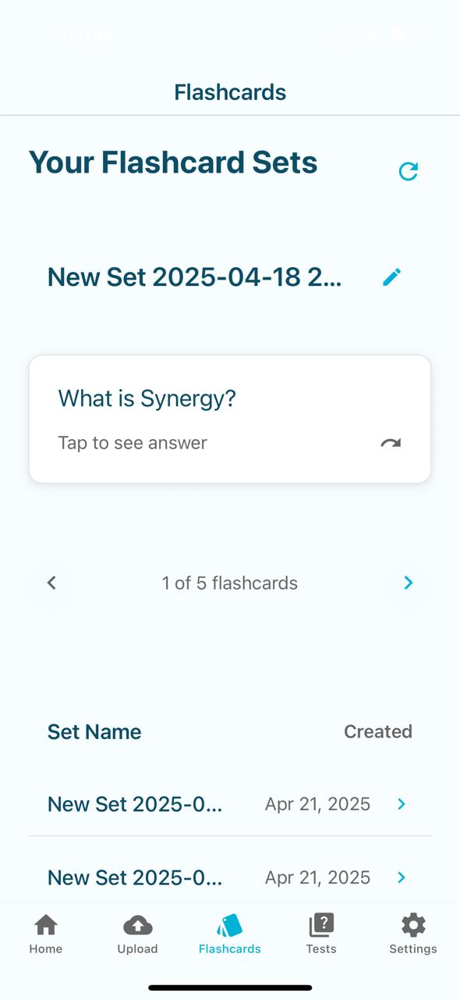

# Flashify

Flashify is an AI-powered learning companion that helps you study smarter. Effortlessly upload your study materials (PDFs, Word documents, or text files) and let Flashify automatically generate flashcards and practice tests to boost your retention and track your progress. Built with React Native, Expo, and a FastAPI backend, Flashify is designed for seamless, cross-platform learning.

---

## Features

- **Upload Documents:** Upload PDFs, Word documents, or text files to generate flashcards automatically.
- **Smart Flashcards:** AI-powered flashcards that help you learn more effectively.
- **Practice Tests:** Test your knowledge with automatically generated quizzes.
- **Progress Tracking:** Track your study progress and revisit weak areas.
- **Modern UI:** Clean, mobile-first interface with intuitive navigation.

---

## Screenshots

| Home Screen       | Upload Document     | Flashcards              | Edit Set Name              | Test Example              |
| ----------------- | ------------------- | ----------------------- | -------------------------- | ------------------------- |
|  |  |  |  |  |

---

## Technologies Used

### Frontend

- React Native
- Expo
- TypeScript
- Tailwind CSS (via tailwind-merge)
- React Navigation
- Supabase (for authentication and storage)

### Backend

- FastAPI
- Python
- Supabase (database & storage)
- LangChain, Google Gemini API (for AI flashcard generation)
- Uvicorn (ASGI server)

---

## How to Run Locally

### 1. Clone the repository

```bash
git clone https://github.com/harshalself/Flashify.git
cd Flashify
```

### 2. Install dependencies

```bash
cd my-app
npm install
```

### 3. Set up environment variables

- Copy `.env.example` to `.env` and fill in your Supabase and API keys as needed.

### 4. Start the backend (FastAPI)

```bash
cd backend
pip install -r requirements.txt
uvicorn main:app --reload --host 0.0.0.0 --port 8000
```

### 5. Start the frontend (Expo)

```bash
cd .. # if in backend
npm start
```

- Use the Expo app on your device or an emulator to preview the app.

---

## How to Contribute

1. Fork this repository.
2. Create a new branch: `git checkout -b feature/your-feature-name`
3. Make your changes and commit them: `git commit -m 'Add some feature'`
4. Push to your branch: `git push origin feature/your-feature-name`
5. Open a Pull Request describing your changes.

---

## License

[MIT](LICENSE)
